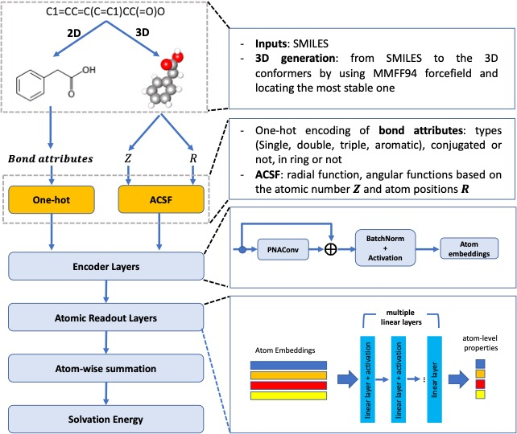

<h1 align="center">Accurate prediction of aqueous free solvation energies using 3D atomic feature-based graph neural network with transfer learning</h1>
<h4 align="center">Dongdong Zhang, Song Xia, and Yingkai Zhang</h4>



The repository contains all of the code and instructions needed to reproduce the experiments and results of **[Accurate prediction of aqueous free solvation energies using 3D atomic feature-based graph neural network with transfer learning]**. We show the whole process from datasets to model training step-by-step.

## Table of Contents
- Project organization
- Conda environment setup  
- Datasets downloading   
- Data preprocessing  
- Training
- References
---

## 1. Project organization
```
|- README.md                                <- this file
|- scr                                      <- Main code of this work
    |- train.py
    |- trainer.py
    |- model.py
    |- gnns.py
    |- k_gnn.py
    |- supergat_conv.py
    |- layers.py
    |- prepare_data.py
    |- featurization.py
    |- helper.py
    |- args.py              
|- data                                     <- where data are saved       
    |- Frag20-Aqsol-100K
        |- split                            <- train/validation/test csv files    
        |- sdf                              <- SDF files for all molecules   
        |- xyz                              <- XYZ files for all molecules   
    |- FreeSolv
        |- split                            <- train/validation/test csv files    
        |- sdf                              <- SDF files for all molecules   
        |- xyz                              <- XYZ files for all molecules   
|- models                                   <- where pretrained models are saved for use
    |- Frag20-Aqsol-100K
        |- pretrained
            |- 3D_MMFF
            |- 3D_QM
            |- 2D
```

## 2. Conda environment setup: 
Python 3.8 is recommended here with the **[miniconda3](https://docs.conda.io/en/latest/miniconda.html)**. 
The package installation order is recommended as below: 
- PyTorch. 
`conda install pytorch cudatoolkit=10.2 -c pytorch`
To be noted, in order to be compatible with the installation of Torch-geometric, cuda10.2 for torch should be used here. 
- **[Torch geometirc](https://github.com/pyg-team/pytorch_geometric)**.  

`conda install pyg -c pyg`

- **[rdkit](https://www.rdkit.org/docs/Install.html)**.  

`conda install -c conda-forge rdkit`

- **[DSCRIBE](https://singroup.github.io/dscribe/latest/install.html)**.  

`conda install -c conda-forge dscribe`

- PrettyTable.  

`conda install -c conda-forge prettytable`

## 3. Datasets downloading
Since the 3D structures are stored in SDF and XYZ formats for Frag20-Aqsol-100K, they are saved elsewhere and can be downloaded either from our IMA website or using the following command line. 
- To download and save SDF files for MMFF-optimized geometries: 

> `cd ./data/Frag20-Aqsol-100K/sdf/MMFF/`  (navigate to the corresponding directory)  
> `wget link` (link can be copied from IMA)  

- To download XYZ files for MMFF-optimized geometries:   

> `cd ./data/Frag20-Aqsol-100K/xyz/MMFF/`  (navigate to the corresponding directory)  
> `wget link` (link can be copied from IMA)  

- To download SDF files for QM-optimized geometries:  

> `cd ./data/Frag20-Aqsol-100K/sdf/QM/`  (navigate to the corresponding directory)  
> `wget link` (link can be copied from IMA)  

- To download XYZ files for QM-optimized geometries:  

> `cd ./data/Frag20-Aqsol-100K/xyz/QM/`  (navigate to the corresponding directory)  
> `wget link` (link can be copied from IMA)  

After downloading the tar.bz2 file, unzip it using `tar -xf`. You should see a list of folders. Then check the total number of files: `find .-type f | wc -l`, which should return 100000 (except the tar.bz2 file).  


## 4. Data preprocessing
To generate molecule graph datasets for Torch geometric reading, the `preprae_data.py` contains the codes for Frag20-Aqsol-100K and FreeSolv. For example, the following command line is used to process each molecule in Frag20-Aqsol-100K by featurizing atoms/bonds using 3D atomic features.   

`python prepare_data.py  --data_path <path> --save_path <save_path> --dataset Frag20-Aqsol-100K --ACSF --cutoff 6.0 --xyz MMFF --train_type TS`  


where `<path>` is the path to the place where folders sdf, xyz and split are all saved, `<save_path>` is the same path as `data_path` for default where a new directory `graphs` will be created. `--ACSF` means the 3D features are used here. `--cutoff` is the parameter for ACSF functions. `--xyz` means if the MMFF-optimized or QM-optimized geometries are used. `--train_type` means if we save the graph datasets to train the model from scratch (TS) or not. 

After running the above script, there will be a directory generated in the `<save_path>` in the format of `graphs/3D_TS_MMFF/raw` where 3D means `ACSF` is called here, MMFF means `xyz` is using MMFF geometries, TS means the `train_type` is training from scratch (TS), and `raw` is the required folder by torch geometric. 

## 5. Training
To train different tasks, the `train.py` contains the codes. For example, the following command line is used to process each molecule in Frag20-Aqsol-100K by featurizing atoms/bonds using 3D atomic features.  

`python train.py --data_path <path> --running_path <restuls_path> --dataset Frag20-Aqsol-100K --gnn_type <GNN> --seed <seed> --train_type TS --style <STYLE> --experiment <EXP> --fully_connected_layer_sizes [120, 60] --bn --residual_connect --data_seed <dataRandomSeed> --train_size <tr_size> --val_size <val_size> --test_size <tst_size>`

where `<path>` is same as the above `<save_path>` in Step 3, `<results_path>` is where the results are saved. `<GNN>` is the GNN module used to build the model. For example, `PNAConv`. `<seed>` is the random seed to initialize the weights. `<STYLE>` should be consistent with the folder where processed datasets are saved, for example, `3D_TS_MMFF` from the script in Step 3. `<EXP>` is any experiment names for the job running. `[120 60]` means the dimensions for readout layers are 120, 60, except for the last layer with 1 be the dimension. `--bn` means using the batch normalization. `--residual_connect` means using the residual connection. `<dataRandomSeed>` only works when `--sample` is called to do the random splits. 

After running the script, there will be a new directory generated in the format of `<results_path>` + `Frag20-Aqsol-100K` + `1-GNN` + `<GNN>` + `<EXP>`, where file, `config.json`, training results file `data.txt`, and two folders where the model parameters for best model (lowest validation error) and last-epoch model are saved: `model_best.pt` and `last_model.pt`. 

If finetuning the FreeSolv task, argment `--preTrainedPath` should be explicitly called. It should point to the direcotry where `model_best.pt` is saved. Here in this repo, we saved our previously trained models on Frag20-Aqsol-100K using MMFF-optimized geometries, QM-optimized geometris and 2D for use, which are saved in `models/Frag20-Aqsol-100K/pretrained/`. 

## 6. References
ChemProp: https://github.com/chemprop/chemprop
k-gnn: https://github.com/chrsmrrs/k-gnn
SuperGAT: https://github.com/dongkwan-kim/SuperGAT
